# Notifications Gallery
The notifications and background images used in the final programme, in no particular order:
See if you can catch any easter eggs!

## Background
    

## Notifications

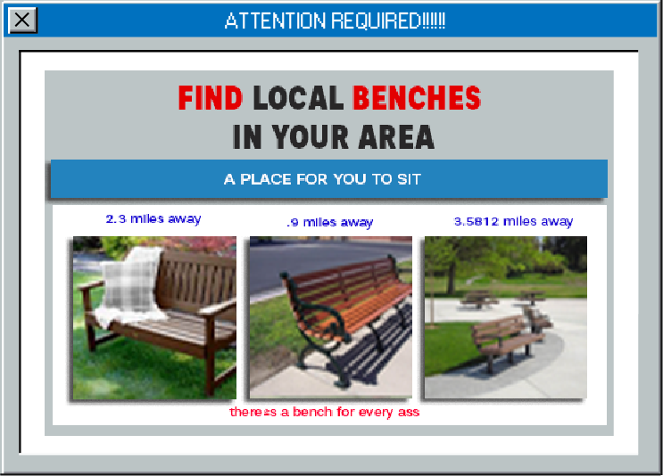
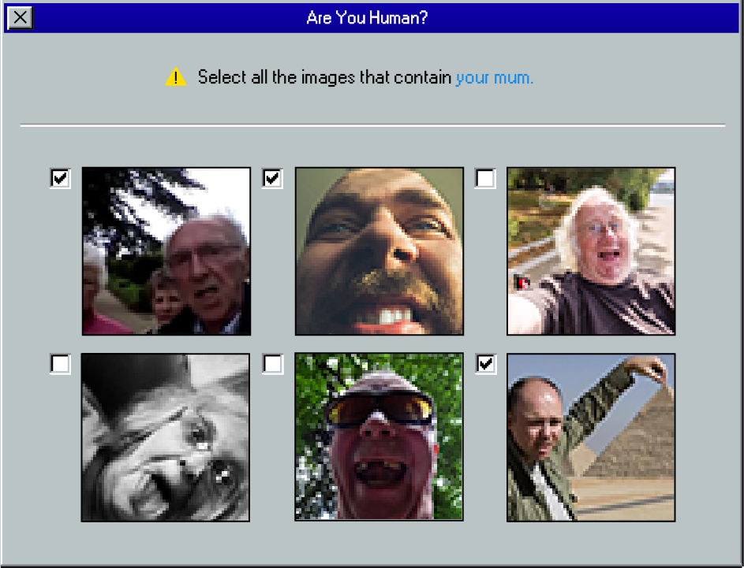    
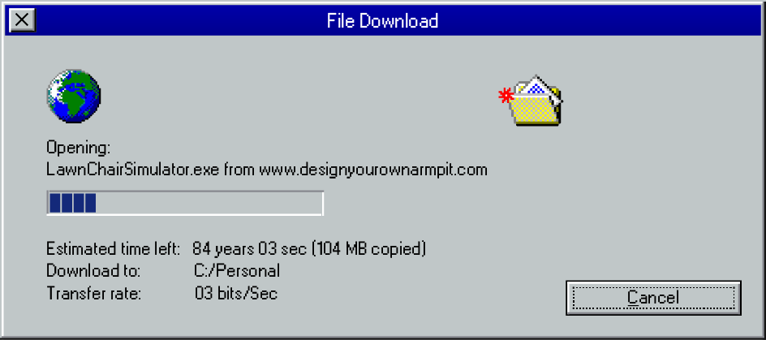    
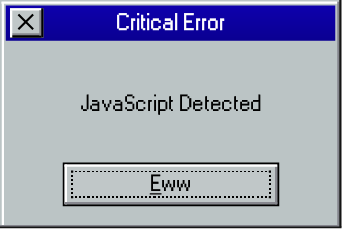    
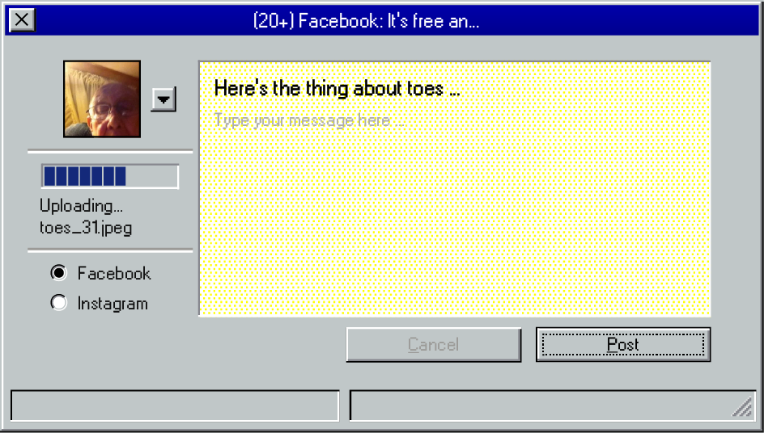    
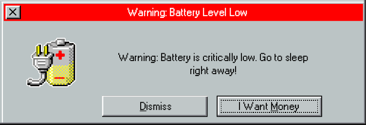    
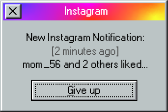    
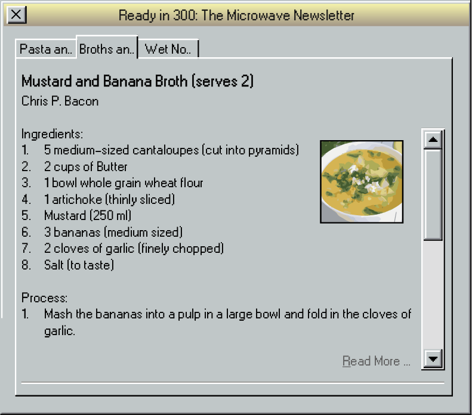    
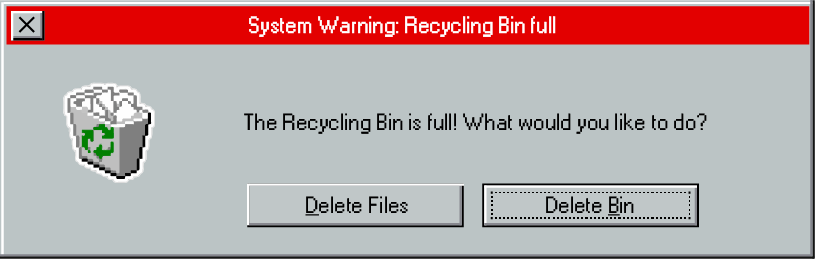    
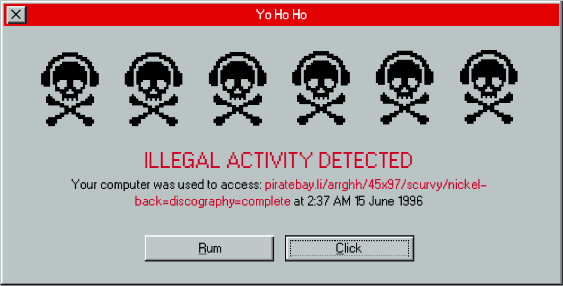    
    
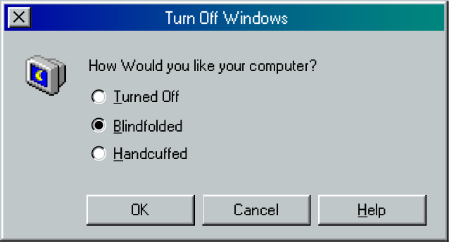    
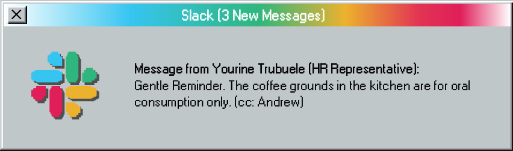    
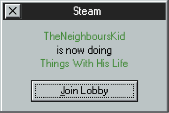    
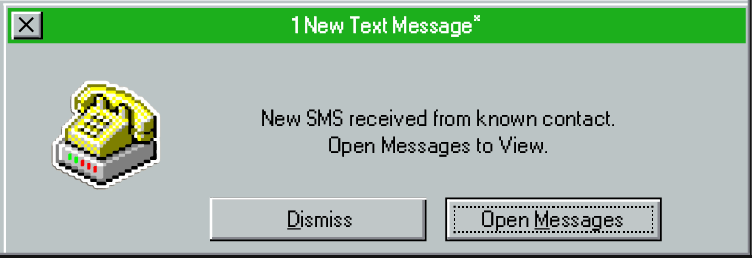    
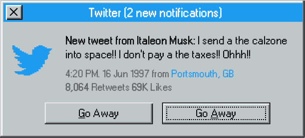    
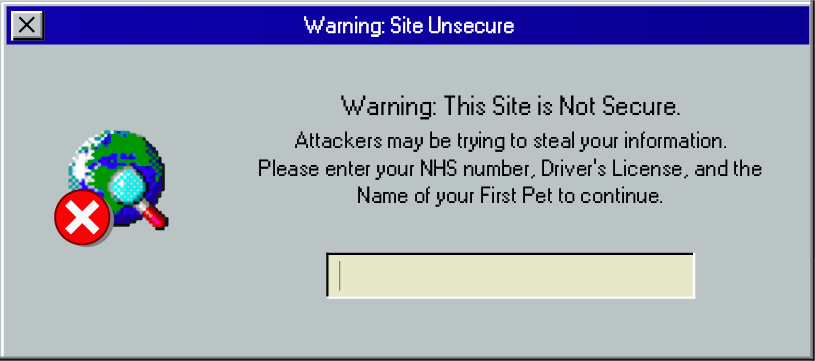    
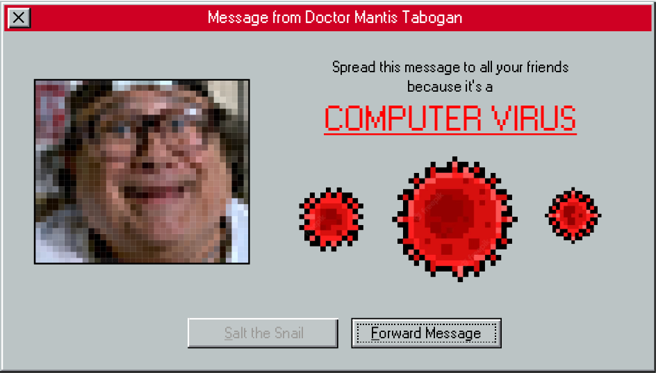    
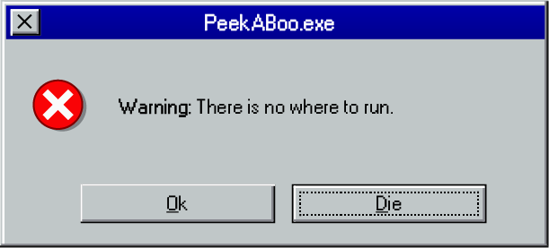    
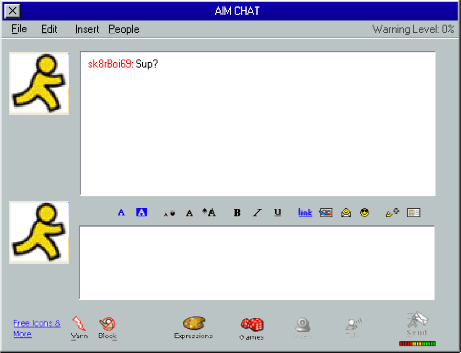   
